# Results

Reproduction trail for every artefact in `persist/`. Run from project root after `uv sync --project final`.

## 1. Download CIFAKE

Pulls the CIFAKE dataset from Kaggle and lays out the train/test folders so that PyTorch's `ImageFolder` can read the two classes.

```sh
uv run --project final python scripts/1_get_original_data.py
```

-> `data/train/{FAKE,REAL}/` and `data/test/{FAKE,REAL}/`

---

## 2. Inspect raw and normalised samples

Picks a small random batch from each class and saves it as a grid, both before and after Z-score normalisation. The two views are visually similar because the display step rescales back into [0,1], even though the tensor values fed into the model are zero-mean and unit-variance per channel.

```sh
uv run --project final python -m final.sample_grid
```

-> `persist/images/sample_grid.png`

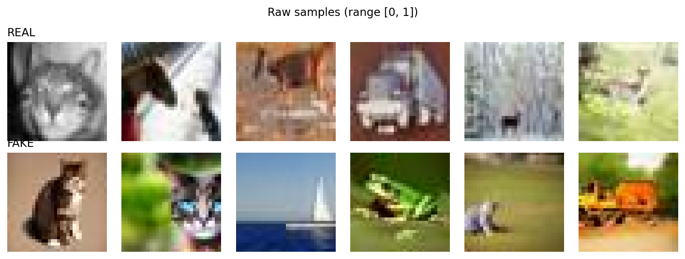

-> `persist/images/sample_grid_norm.png`

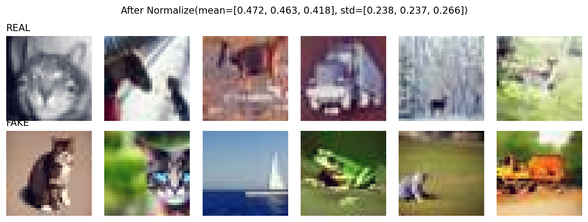

---

## 3. Per-class 2D FFT spectrum

Computes the mean 2D Fourier log-magnitude spectrum of 5,000 samples per class. The centre of each panel encodes coarse image structure (low frequencies); the corners encode fine texture (high frequencies). The right-hand "signed difference" panel highlights that FAKE images carry noticeably more high-frequency energy, which is the diffusion decoder fingerprint we exploit later.

```sh
uv run --project final python -m final.fft_spectrum
```

-> `persist/images/fft_spectrum.png`

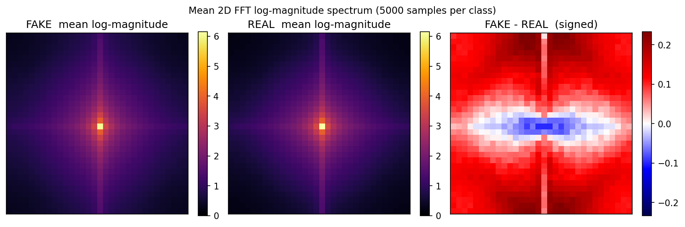

---

## 4. Learning-rate sweep (per model)

Trains each model from scratch for 10 epochs on a 20% subsample, repeated across seven learning rates spanning four orders of magnitude. Reports the best validation accuracy reached during each run, giving a clear picture of the LR-vs-accuracy curve and locating the per-model optimum.

```sh
uv run --project final python -m final.hp_sweep --model cnn --param lr
uv run --project final python -m final.hp_sweep --model resnet_scratch --param lr
```

-> `persist/images/cnn/hp_sweep_lr.png`

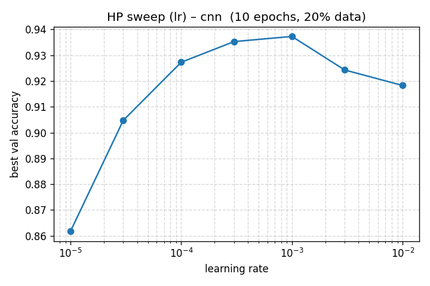

-> `persist/images/resnet_scratch/hp_sweep_lr.png`

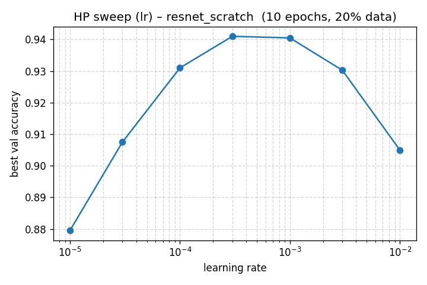

---

## 5. Weight-decay sweep (per model)

Same protocol as the LR sweep, but varying weight decay across five values from $10^{-6}$ to $10^{-2}$ with the learning rate held at the per-model optimum found in step 4.

```sh
uv run --project final python -m final.hp_sweep --model cnn --param weight_decay
uv run --project final python -m final.hp_sweep --model resnet_scratch --param weight_decay
```

-> `persist/images/cnn/hp_sweep_weight_decay.png`

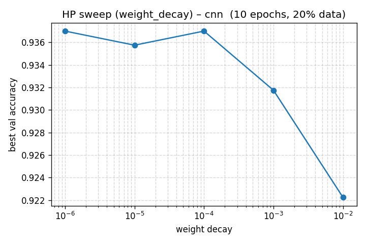

-> `persist/images/resnet_scratch/hp_sweep_weight_decay.png`

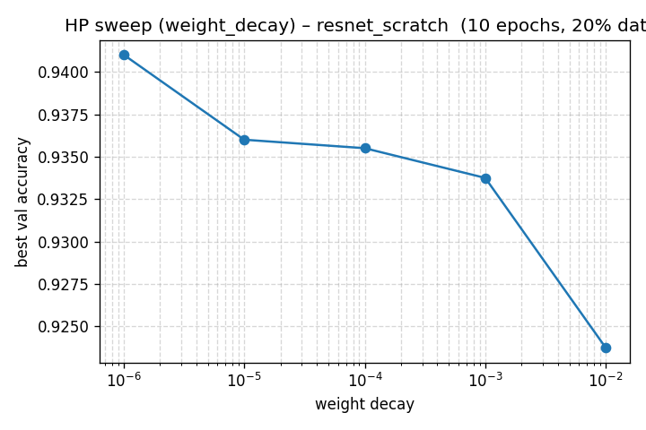

---

## 6. Overlay both models on a single sweep plot

Re-renders the sweeps from steps 4 and 5 with both models on the same axes for a direct side-by-side comparison. The white markers indicate the operating point chosen for the final training runs.

```sh
uv run --project final python -m final.hp_sweep_combined --param lr
uv run --project final python -m final.hp_sweep_combined --param weight_decay
```

-> `persist/images/hp_sweep_combined.png`

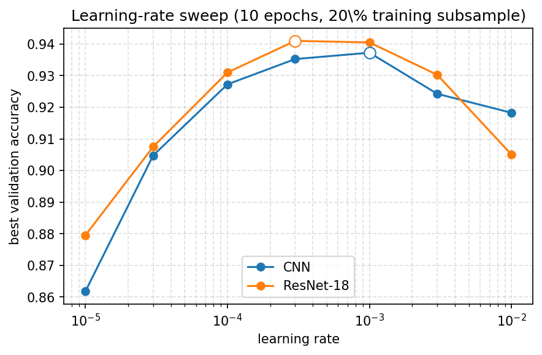

-> `persist/images/hp_sweep_weight_decay_combined.png`

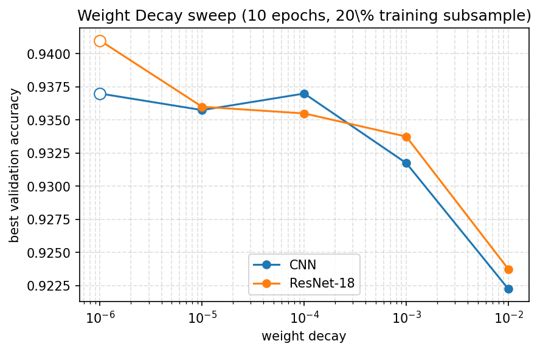

---

## 7. Train (full data, chosen hyperparameters)

Trains each model on the full 80,000-image training pool with the LR and weight decay picked from the sweeps. Augmentation, early stopping and best-checkpoint policy run as described in the report. The curve plot shows the per-epoch training and validation loss; a small gap throughout indicates controlled fitting, a widening gap indicates the onset of overfitting and triggers early stopping.

```sh
uv run --project final python -m final.train --model cnn
uv run --project final python -m final.train --model resnet_scratch
uv run --project final python -m final.train --model cnn --no-normalize
uv run --project final python -m final.train --model resnet_scratch --no-normalize
```

-> `persist/checkpoints/<model>/best.pth` + `history.json`
-> `persist/images/<model>/curves.png`

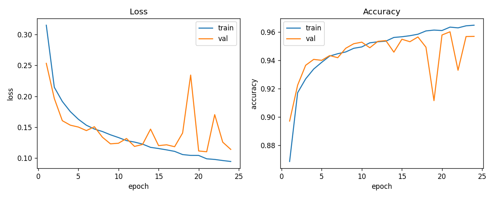

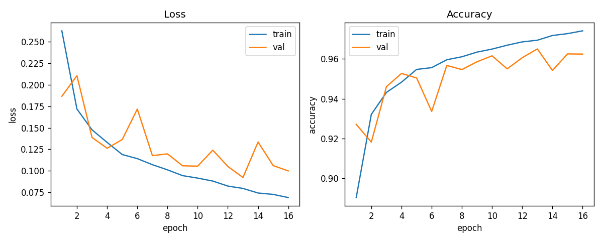

---

## 8. Evaluate on the held-out CIFAKE test split

Loads the best checkpoint of each model and reports accuracy, precision, recall, F1 and AUC on the 20,000-image test partition that was untouched during training and hyper-parameter selection. The confusion matrices show class-level error patterns; the per-model ROC plots show how the true-positive and false-positive rates trade off as the decision threshold slides from 0 to 1.

```sh
uv run --project final python -m final.evaluate --model cnn
uv run --project final python -m final.evaluate --model resnet_scratch
uv run --project final python -m final.evaluate --model cnn --no-normalize
uv run --project final python -m final.evaluate --model resnet_scratch --no-normalize
```

-> `persist/checkpoints/<model>/metrics.json`
-> `persist/images/<model>/confmat.png`, `roc.png`, `misclassified.png`

| Model | Acc | Prec | Rec | F1 | AUC |
|-------|-----|------|-----|----|-----|
| CNN       | 0.962 | 0.952 | 0.972 | 0.962 | 0.994 |
| ResNet-18 | 0.967 | 0.968 | 0.966 | 0.967 | 0.995 |

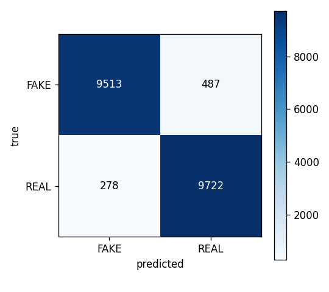 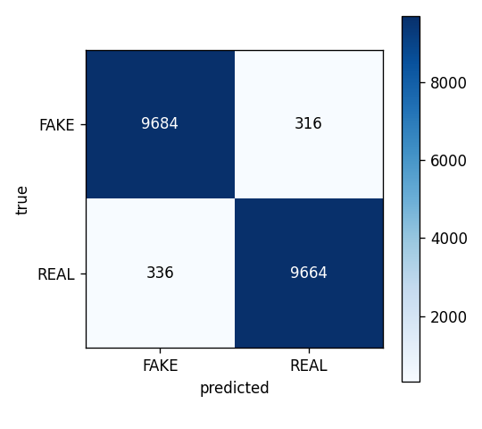

 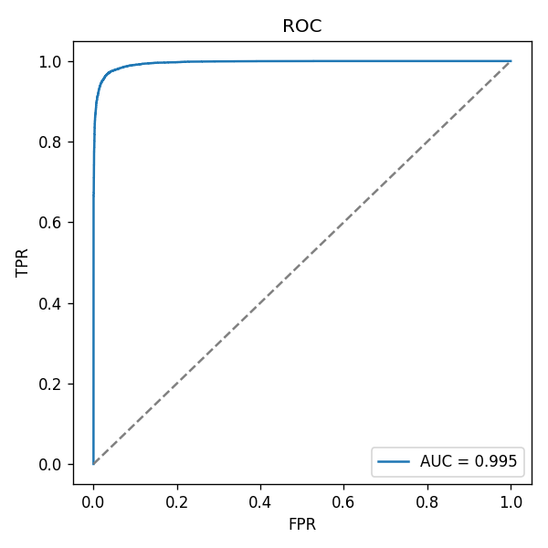

---

## 9. Overlay ROC curves of both models

Plots the ROC curves of the two models on a single set of axes, with the dashed grey diagonal representing a random classifier. Both curves hug the top-left corner: the AUCs of 0.994 and 0.995 are essentially indistinguishable, so the small accuracy gap reported in step 8 is not produced by an unfortunate threshold choice.

```sh
uv run --project final python -m final.roc_combined
```

-> `persist/images/roc_combined.png`

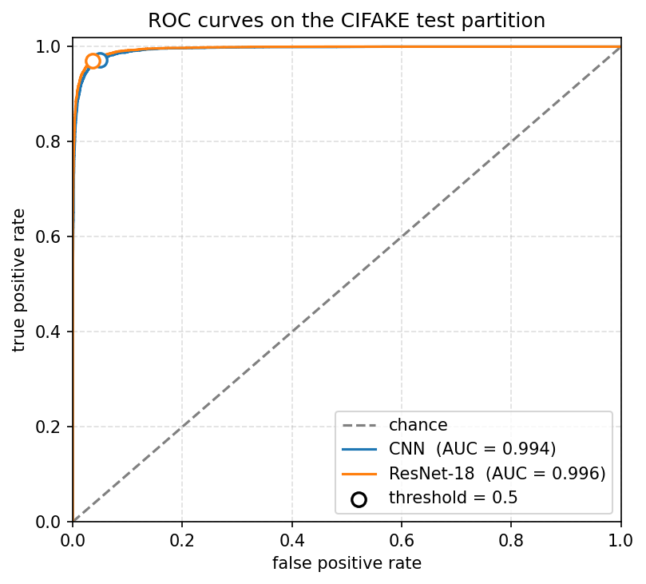

---

## 10. Cross-generator evaluation on Defactify

Loads the trained CIFAKE detectors and runs them, without retraining, on 500 real plus 500 synthetic images per generator from the Defactify dataset (Stable Diffusion 2.1, SDXL, Stable Diffusion 3, DALL-E 3, Midjourney v6). The full per-(generator, model) metrics land in the JSON file below.

```sh
uv run --project final python scripts/2_external_eval.py
```

-> `persist/images/external_metrics.json`

Accuracy range across the five generators: 0.43 – 0.67. AUC falls to 0.45 on Midjourney v6, confirming the detector does not transfer beyond Stable Diffusion 1.4.

---
